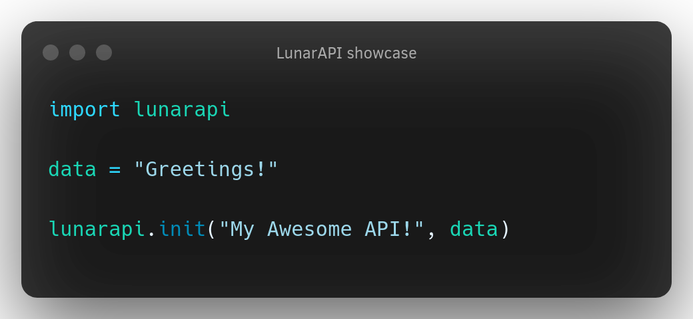

<h1 align="center"><code>LunaraAPI</code></h1>
<p align="center">Wrapper around Flask-Restful</p>

<p align="center">
<a href="assets/showcase.png">
  
</a>
</p>

## Dependencies
- Python 3.6+
- pip
<br></br>

## Installation

From source:
```bash
git clone https://github.com/LunarPyOrg/lunarapi
cd lunaraapi/lunarapi
pip install .
```

## Usage

```python
import lunarapi

data = "Data That will be sent"

lunarapi.init(Appname="My Awesome app",
                DataInput=data,
                Debug=True,
                Randomic=True,
                URL="/")
# Debug - Enable debug mode
# Randomic - Enable random requests
# URL - What subdomain the API will be served
```